# IIoT Edge Gateway

<p align="center">
  <strong>Промышленный IoT Edge Gateway</strong><br>
  Платформа сбора данных, преобразования протоколов и граничных вычислений уровня EMQX Neuron
</p>

<p align="center">
  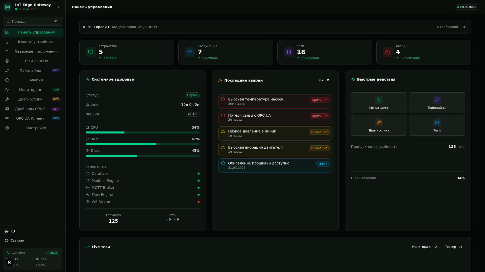
</p>

---

[](LICENSE)
[](https://www.typescriptlang.org/)
[](https://nextjs.org/)
[](https://tailwindcss.com/)
[](#поддержка-протоколов)
[](#шаблоны-устройств)

---

## Обзор

IIoT Edge Gateway — это комплексная платформа промышленного интернета вещей (IoT) для граничных вычислений, предназначенная для сбора данных, преобразования протоколов и обработки данных в реальном времени. Построенная на современных веб-технологиях, она предоставляет интуитивный веб-интерфейс HMI/SCADA для управления южными устройствами (ПЛК, датчиками, исполнительными механизмами) и северными приложениями (облачными коннекторами, историками, брокерами сообщений).

Платформа следует **архитектуре EMQX Neuron** и реализует спецификацию **OPA-S (Open Platform Architecture — South)** для управления драйверами протоколов.

## Возможности

### Поддержка протоколов (30+ драйверов)

| Категория | Протоколы |
|-----------|-----------|
| **Последовательные** | Modbus TCP, Modbus RTU, Modbus ASCII, HART, HART-IP |
| **Промышленные ПЛК** | Siemens S7, Allen-Bradley (EtherNet/IP), Omron FINS, Mitsubishi MELSEC |
| **Автоматизация процессов** | OPC UA, IEC 60870-5-104, DNP3, IEC 61850 |
| **Автоматизация зданий** | BACnet/IP, KNX |
| **Сетевые** | SNMP v1/v2c/v3 |
| **Облачные / Северные** | MQTT v5, Apache Kafka, HTTP REST, WebSocket, AWS IoT Core, Azure IoT Hub |

<p align="center">
  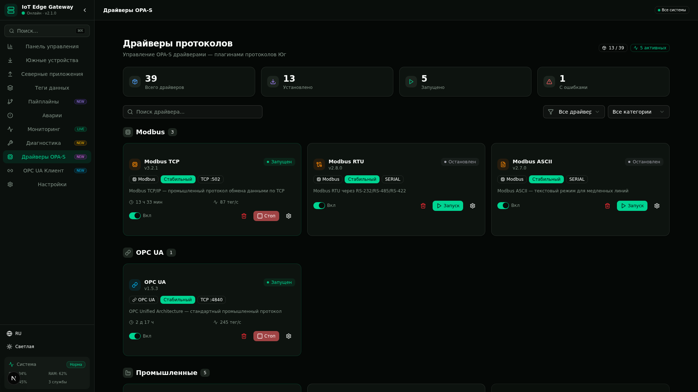
</p>

### Управление южными устройствами

- **90+ шаблонов устройств** из 12 категорий (ПЛК, частотные преобразователи, датчики, модули ввода/вывода, счётчики, шлюзы)
- **Создание устройств из шаблонов** — выберите производителя/модель и автоматически получите карту регистров
- **Мониторинг тегов в реальном времени** с индикаторами качества (Хорошо/Плохо/Неопределено) и мини-графиками истории
- **Импорт/Экспорт** конфигураций устройств в формате JSON
- **Поддержка последовательных и TCP** соединений с настраиваемыми тайм-аутами, повторами, порядком байтов

<p align="center">
  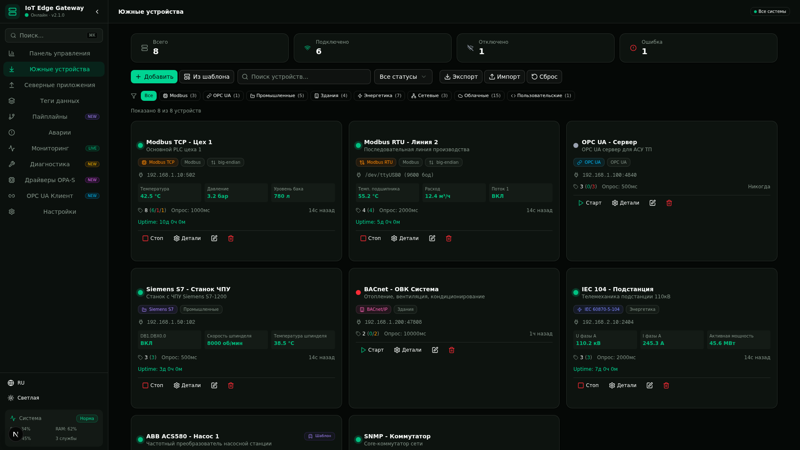
</p>

### Теги данных

- **Полное управление жизненным циклом тегов** — создание, настройка, мониторинг, запись значений
- **Типы данных**: BOOL, INT16, UINT16, INT32, UINT32, FLOAT32, STRING
- **Типы регистров**: Holding Register, Input Register, Coil, Discrete Input
- **Конфигурация аварийных сигналов** для каждого тега с порогами, зоной нечувствительности и задержкой
- **Симуляция значений в реальном времени** с отслеживанием качества и индикаторами тренда

<p align="center">
  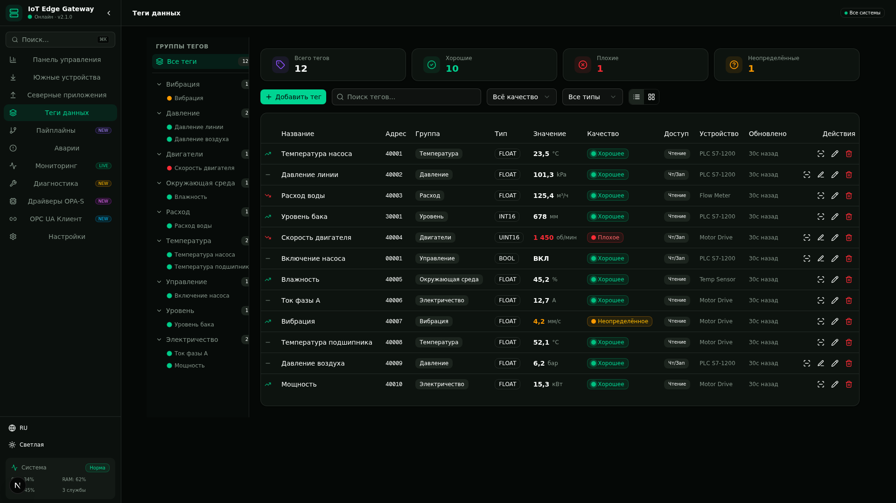
</p>

### Конвейерная обработка данных

- **Визуальный узловой редактор конвейеров** с перетаскиванием
- **13 типов узлов**: Источник южного устройства, Чтение тега, Преобразование данных, Фильтр, Агрегатор, Скрипт, MQTT Publish, HTTP Push, Kafka Producer, WebSocket, Логгер, Проверка аварий, Задержка
- **8 шаблонов конвейеров** для типичных схем потока данных
- **Анимированные SVG-соединения** с направленными стрелками и эффектом свечения
- **Симуляция тестового запуска** с последовательным журналом обработки

<p align="center">
  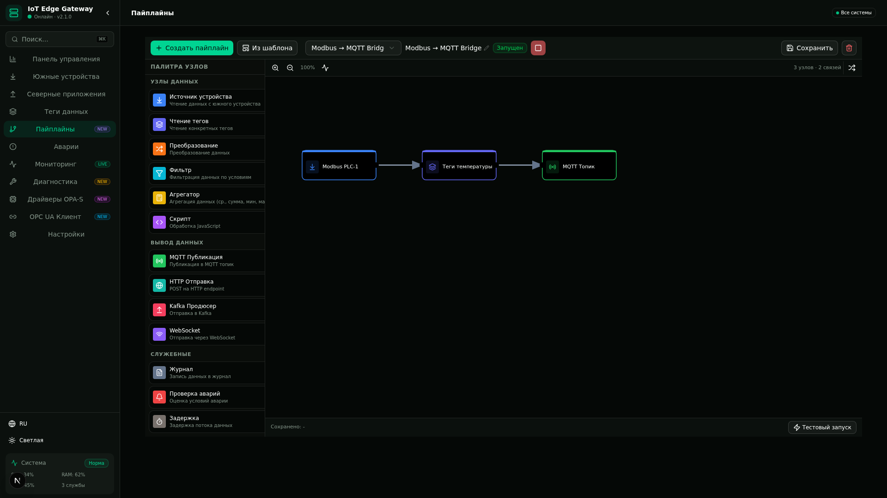
</p>

### Северные приложения (13 шаблонов)

- **MQTT** — Eclipse Mosquitto, EMQX, HiveMQ (включая blue-traktor.ru:1888)
- **Историки** — InfluxDB, TimescaleDB, OSIsoft PI System
- **Потоковая передача** — Apache Kafka, AWS Kinesis
- **Облако** — AWS IoT Core, Azure IoT Hub, Google Cloud IoT
- **Интеграция** — HTTP REST Push, WebSocket Stream
- **Корпоративные системы** — SAP, OPC UA Server

<p align="center">
  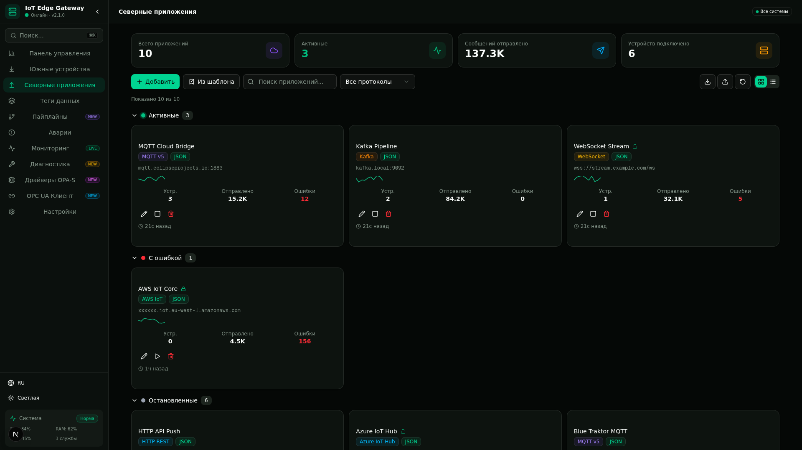
</p>

### Мониторинг в реальном времени

- **Потоковая передача по WebSocket** для живых значений тегов и метрик системы
- **Круговые SVG-датчики** для утилизации CPU, памяти, сети
- **Мини-графики** для каждого тега (последние 20 точек данных)
- **Бегущая строка аварий** с цветовой кодировкой по серьёзности (Критично/Внимание/Информация)
- **Панель состояния соединений** с живыми индикаторами здоровья
- **Резервная симуляция** при недоступности WebSocket

<p align="center">
  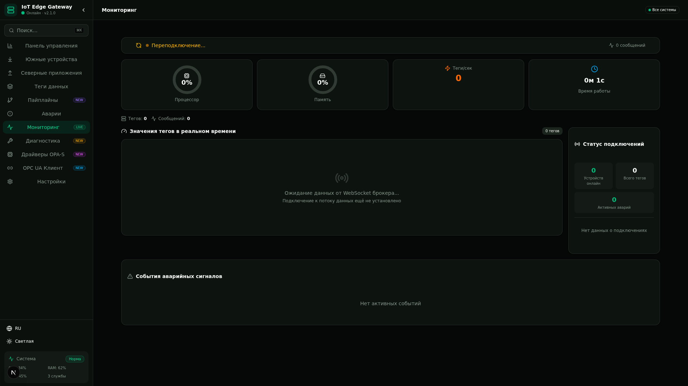
</p>

### Диагностика

- **Тестер Modbus TCP** — чтение/запись регистров и катушек, просмотр карты регистров
- **Тестер MQTT** — публикация/подписка, просмотр дерева тем, история сообщений
- **Здоровье системы** — одновременная проверка всех мини-сервисов с отображением времени отклика
- **Журнал действий** с замерами времени запрос/ответ

<p align="center">
  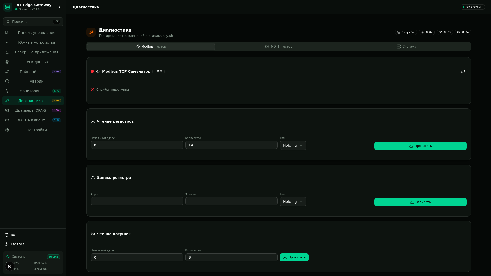
</p>

### OPC UA Клиент

- **Управление подключениями** с режимами безопасности (Нет/Подпись/ПодписьИШифрование)
- **Браузер информационной модели** — иерархическое дерево со стандартной структурой узлов OPC UA
- **Панель детализации узла** — ссылки, отображение значений, пороги аварий, мини-графики истории
- **Подписки** — создание/управление подписками с отслеживаемыми элементами
- **Поддержка пространств имён** — ns0 (OPC UA), ns1 (Приложение), ns2 (Машина), ns3 (Безопасность)

<p align="center">
  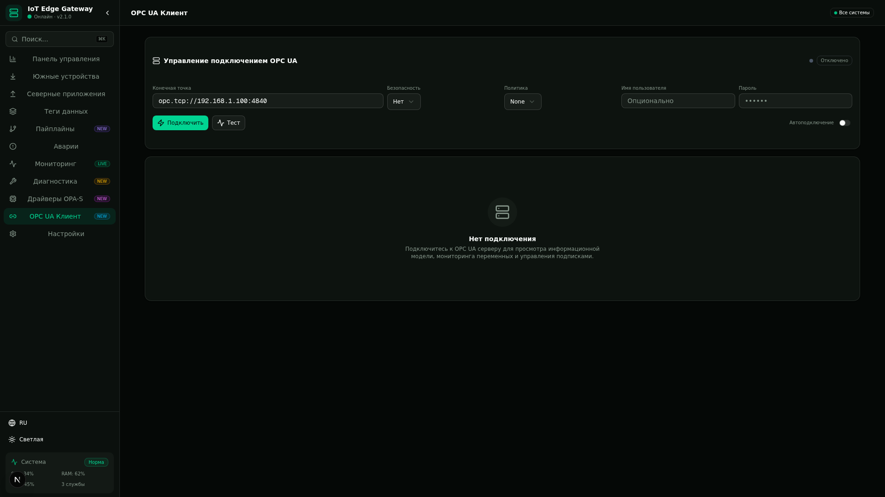
</p>

### Управление авариями

- **Активные аварии** с уровнями серьёзности (Критично, Внимание, Информация) и рабочим процессом квитирования
- **Правила аварий** — настраиваемые пороги, условия, зона нечувствительности, задержка
- **Журнал аварий** — полный журнал событий с метками времени срабатывания, квитирования и сброса

<p align="center">
  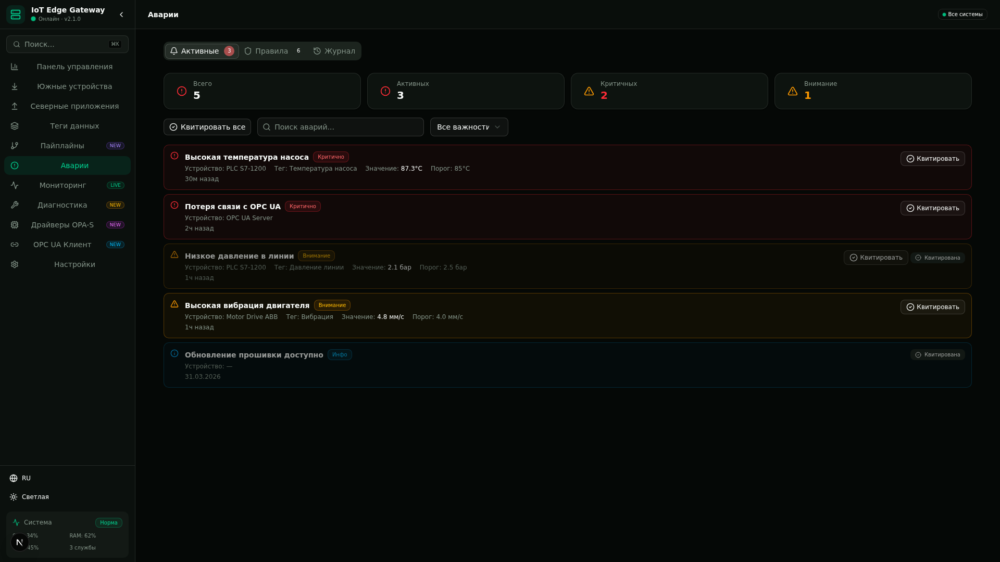
</p>

### Промышленная RBAC (управление доступом на основе ролей)

- **7 иерархических ролей** (L1 Оператор → L7 Суперадминистратор)
- **37 детальных разрешений** в 12 категориях
- **Визуальная матрица разрешений** для удобного управления ролями
- **Управление пользователями** с назначением ролей, контролем статуса, отслеживанием активности

### 4-уровневое лицензирование

| Уровень | Устройства | Теги | Протоколы | Возможности |
|---------|------------|------|-----------|-------------|
| **Free** | 5 | 50 | Modbus, MQTT | Базовый мониторинг |
| **Standard** | 25 | 500 | + OPC UA, BACnet | Аварии, конвейеры, REST API |
| **Professional** | 100 | 5 000 | + Siemens, AB, SNMP | OPC UA сервер, скрипты, HA |
| **Enterprise** | Без ограничений | Без ограничений | Все | PI System, SSO, аудит, приоритетная поддержка |

<p align="center">
  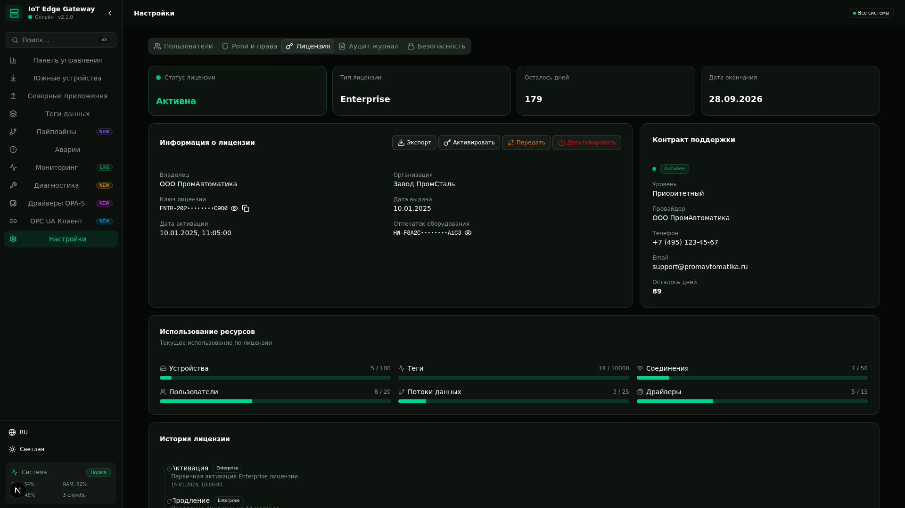
</p>

### Безопасность

- **Политика паролей** — минимальная длина, требования к сложности
- **Белый список IP** — ограничение доступа по диапазонам IP-адресов
- **Поддержка 2FA** (двухфакторной аутентификации, конфигурация доступна)
- **Управление API-ключами** — генерация, ротация, отзыв
- **Журнал аудита** — полный журнал действий с метками времени и отслеживанием пользователей
- **Политика безопасности** — [SECURITY.md](SECURITY.md)

<p align="center">
  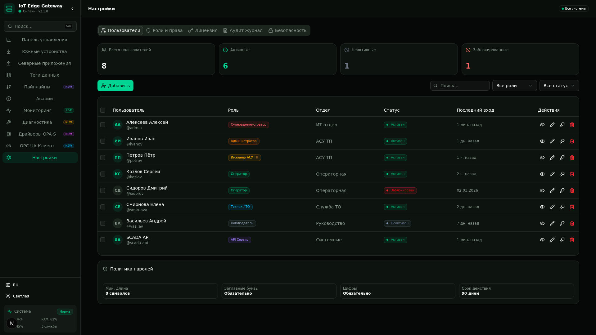
</p>

### Тёмная тема

<p align="center">
  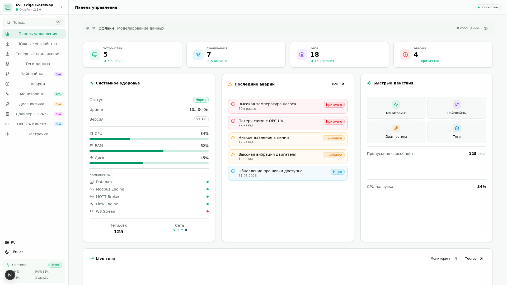
</p>

## Архитектура

```
┌─────────────────────────────────────────────────────────────┐
│                     Web HMI (Next.js 16)                    │
│  Панель │ Устройства │ Теги │ Конвейеры │ Мониторинг        │
│  Аварии │ Диагностика │ Драйверы │ OPC UA │ Настройки       │
└────────────────────────┬────────────────────────────────────┘
                         │ REST API / WebSocket
┌────────────────────────┴────────────────────────────────────┐
│                    Ядро Edge Gateway                         │
│  ┌─────────┐ ┌─────────┐ ┌─────────┐ ┌──────────────┐      │
│  │ Modbus  │ │ OPC UA  │ │ BACnet  │ │  Конвейерный  │      │
│  │ Движок  │ │ Клиент  │ │ Стек    │ │    Движок     │      │
│  └────┬────┘ └────┬────┘ └────┬────┘ └──────┬───────┘      │
│       │           │           │               │               │
│  ┌────┴───────────┴───────────┴───────────────┴──────────┐  │
│  │            Движок обработки тегов                      │  │
│  │       Плоская модель данных JSON-LD (OPA-S)            │  │
│  └─────────────────────┬──────────────────────────────────┘  │
│                        │                                     │
│  ┌─────────────────────┴──────────────────────────────────┐  │
│  │            Северные коннекторы                          │  │
│  │  MQTT │ Kafka │ HTTP │ PI System │ AWS │ Azure         │  │
│  └────────────────────────────────────────────────────────┘  │
└─────────────────────────────────────────────────────────────┘
         │              │              │
    ┌────┴────┐   ┌────┴────┐   ┌────┴────┐
    │  ПЛК    │   │ Датчики │   │ Облако  │
    │  ТУ     │   │ Механизмы│  │ SCADA   │
    └─────────┘   └─────────┘   └─────────┘
```

## Технологический стек

| Технология | Назначение |
|-----------|------------|
| **Next.js 16** | React-фреймворк (App Router, Turbopack) |
| **TypeScript 5** | Типобезопасная разработка |
| **Tailwind CSS 4** | Утилитарный подход к стилизации |
| **shadcn/ui** | Библиотека компонентов |
| **Recharts** | Визуализация данных |
| **Lucide Icons** | Система иконок |
| **Prisma ORM** | Слой базы данных |
| **SQLite** | Встраиваемая база данных |
| **WebSocket** | Обмен данными в реальном времени |
| **Zustand** | Управление клиентским состоянием |
| **TanStack Query** | Управление серверным состоянием |

## Мини-сервисы

Шлюз включает 3 независимых микросервиса для разработки и тестирования:

| Сервис | Порт | Описание |
|--------|------|----------|
| **Симулятор Modbus TCP** | 8502 | Полноценный сервер Modbus TCP с 10 000 регистров, катушками, дискретными входами. REST API для операций чтения/записи. Симуляция промышленных значений. |
| **WebSocket Брокер** | 8503 | Потоковая передача данных в реальном времени с 18 симулированными тегами. Каналы: теги, метрики, аварии, статус. |
| **MQTT Мост** | 8504 | Симуляция MQTT pub/sub с деревом тем, сохранёнными сообщениями, подписками, историей сообщений. |

## Быстрый старт

### Предварительные требования

- [Bun](https://bun.sh/) (v1.0+) или Node.js 18+
- Git

### Установка

```bash
# Клонировать репозиторий
git clone https://github.com/KuzinHouse/IIoT-Edge-Gateway.git
cd IIoT-Edge-Gateway

# Установить зависимости
bun install

# Инициализировать базу данных
bun run db:push

# Запустить приложение
bun run dev
```

### Мини-сервисы (опционально)

```bash
# Запустить все мини-сервисы
cd mini-services/modbus-simulator && bun run dev &
cd mini-services/ws-broker && bun run dev &
cd mini-services/mqtt-bridge && bun run dev &
```

Приложение будет доступно по адресу `http://localhost:3000`.

## Структура проекта

```
IIoT-Edge-Gateway/
├── src/
│   ├── app/                    # Next.js App Router
│   │   ├── page.tsx           # Основной каркас приложения
│   │   ├── layout.tsx         # Корневой layout с провайдером темы
│   │   ├── globals.css        # Глобальные стили
│   │   └── api/               # REST API маршруты
│   │       ├── alarms/        # API управления авариями
│   │       ├── connections/   # API управления соединениями
│   │       ├── dashboard/     # API статистики панели управления
│   │       ├── devices/       # API CRUD устройств
│   │       ├── drivers/       # API драйверов протоколов
│   │       ├── flows/         # API конвейеров
│   │       ├── jsonld/        # API модели данных JSON-LD
│   │       ├── license/       # API управления лицензиями
│   │       ├── north-apps/    # API северных приложений
│   │       ├── tags/          # API тегов данных
│   │       └── users/         # API управления пользователями
│   ├── components/
│   │   ├── views/             # Основные экраны приложения (11)
│   │   │   ├── DashboardView.tsx       # Панель управления
│   │   │   ├── SouthDevicesView.tsx    # Южные устройства
│   │   │   ├── NorthAppsView.tsx       # Северные приложения
│   │   │   ├── TagsView.tsx            # Теги данных
│   │   │   ├── PipelineView.tsx        # Конвейеры
│   │   │   ├── AlarmsView.tsx          # Аварии
│   │   │   ├── MonitoringView.tsx      # Мониторинг
│   │   │   ├── DiagnosticsView.tsx     # Диагностика
│   │   │   ├── DriversView.tsx         # Драйверы OPA-S
│   │   │   ├── OPCUAView.tsx           # OPC UA Клиент
│   │   │   └── SettingsView.tsx        # Настройки
│   │   ├── flows/             # Компоненты конвейеров
│   │   ├── tags/              # Компоненты отображения тегов
│   │   ├── ui/                # Компоненты shadcn/ui (50+)
│   │   └── CommandPalette.tsx # Палитра команд Ctrl+K
│   ├── hooks/                 # Пользовательские React-хуки
│   ├── i18n/                  # Интернационализация (EN/RU)
│   ├── lib/
│   │   ├── modbus-templates.ts    # 90+ шаблонов устройств (4378 строк)
│   │   ├── protocol-registry.ts   # 30+ определений протоколов
│   │   ├── pipeline-templates.tsx # 8 шаблонов конвейеров
│   │   ├── north-app-templates.ts # 13 шаблонов северных приложений
│   │   ├── jsonld-model.ts        # Плоская модель данных JSON-LD
│   │   └── ...                    # Утилиты, сервисы, клиент БД
│   └── types/                 # Определения типов TypeScript
├── mini-services/             # Независимые микросервисы
│   ├── modbus-simulator/      # Симулятор Modbus TCP (порт 8502)
│   ├── ws-broker/             # WebSocket Брокер (порт 8503)
│   └── mqtt-bridge/           # MQTT Мост (порт 8504)
├── prisma/
│   └── schema.prisma          # Схема базы данных
├── docs/
│   └── screenshots/           # Скриншоты проекта
├── ARCHITECTURE.md            # Документация по архитектуре (950 строк)
├── DEPLOYMENT.md              # Руководство по развёртыванию (810 строк)
├── SECURITY.md                # Политика безопасности
├── LICENSE                    # Лицензия MIT
└── README.md                  # Этот файл
```

## Модель данных

Все внутренние данные проходят через **плоскую модель данных JSON-LD**, соответствующую спецификации OPA-S:

```json
{
  "@context": "https://iiot-gateway.org/context/v1",
  "@type": "Tag",
  "@id": "tag:temp-reactor-01",
  "name": "Температура реактора",
  "address": "40001",
  "dataType": "FLOAT32",
  "unit": "°C",
  "value": 245.7,
  "quality": "GOOD",
  "timestamp": "2025-01-15T10:30:00Z",
  "device": "device:plc-siemens-01"
}
```

## Лицензия

Этот проект распространяется под лицензией **MIT** — подробности в файле [LICENSE](LICENSE).

## Участие в разработке

1. Сделайте fork репозитория
2. Создайте ветку с функционалом (`git checkout -b feature/amazing-feature`)
3. Закоммитьте изменения (`git commit -m 'Добавлена новая возможность'`)
4. Отправьте в ветку (`git push origin feature/amazing-feature`)
5. Откройте Pull Request

## Поддержка проекта

Если этот проект оказался вам полезен, поддержите его развитие:

- **GitHub Sponsors**: [Спонсировать проект](https://github.com/sponsors/KuzinHouse)
- **Boosty**: [boosty.to/iiot-edge-gateway](https://boosty.to/iiot-edge-gateway)

---

<p align="center">
  Создано с ❤️ для сообщества Промышленного IoT
</p>
